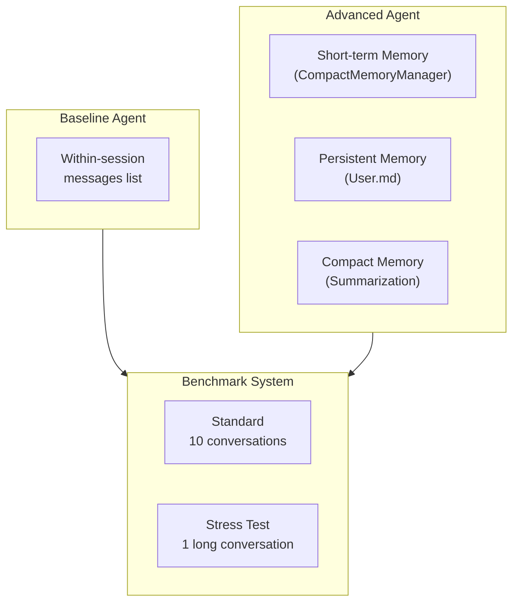

# 📋 BÁO CÁO TỔNG HỢP
> **Đặng Tiến Quyền**
> **2A202600896**
## Day 17 - Track 3: Memory Systems for AI Agent

> **Ngày thực hiện**: 19/06/2026  
> **Thời gian hoàn thành**: ~25 phút  
> **Trạng thái**: ✅ Hoàn thành toàn bộ yêu cầu

---

## 1. Tổng quan dự án

### Mục tiêu
Xây dựng và so sánh hai AI agent có kiến trúc memory khác nhau:
- **Baseline Agent**: chỉ nhớ trong cùng một thread (short-term memory)
- **Advanced Agent**: 3 lớp memory (short-term + persistent User.md + compact memory)

### Kiến trúc tổng quan



---

## 2. Danh sách file đã triển khai

| # | File | Kích thước | Mô tả |
|---|------|-----------|--------|
| 1 | [model_provider.py](file:///e:/AI_Course_2026/Day17-Track03-MemorySystems4Agent/src/model_provider.py) | 3,247 bytes | Factory cho 6 provider: openai, custom, gemini, anthropic, ollama, openrouter |
| 2 | [config.py](file:///e:/AI_Course_2026/Day17-Track03-MemorySystems4Agent/src/config.py) | 4,082 bytes | Load `.env`, cấu hình provider, ngưỡng compact memory |
| 3 | [memory_store.py](file:///e:/AI_Course_2026/Day17-Track03-MemorySystems4Agent/src/memory_store.py) | 13,179 bytes | **Core** — Token estimation, UserProfileStore, CompactMemoryManager |
| 4 | [agent_baseline.py](file:///e:/AI_Course_2026/Day17-Track03-MemorySystems4Agent/src/agent_baseline.py) | 5,692 bytes | Agent A — within-session memory only |
| 5 | [agent_advanced.py](file:///e:/AI_Course_2026/Day17-Track03-MemorySystems4Agent/src/agent_advanced.py) | 10,073 bytes | Agent B — 3-layer memory system |
| 6 | [benchmark.py](file:///e:/AI_Course_2026/Day17-Track03-MemorySystems4Agent/src/benchmark.py) | 8,796 bytes | Standard + Stress benchmark, 6 cột output |
| 7 | [test_agents.py](file:///e:/AI_Course_2026/Day17-Track03-MemorySystems4Agent/src/test_agents.py) | 6,618 bytes | 4 test cases cho User.md, compact, recall, prompt load |
| 8 | [analysis.md](file:///e:/AI_Course_2026/Day17-Track03-MemorySystems4Agent/src/analysis.md) | 5,696 bytes | Phân tích trade-off và kết luận |

> **Tổng code**: ~51,687 bytes (~8 files Python + 1 file analysis)

---

## 3. Kết quả chạy Test

```
============================= test session starts =============================
platform win32 -- Python 3.12.0, pytest-9.1.0

test_agents.py::test_user_markdown_read_write_edit    PASSED  ✅
test_agents.py::test_compact_trigger                  PASSED  ✅
test_agents.py::test_cross_session_recall             PASSED  ✅
test_agents.py::test_compact_reduces_prompt_load      PASSED  ✅

============================== 4 passed in 0.10s ==============================
```

| Test | Mục đích | Kết quả |
|------|----------|---------|
| `test_user_markdown_read_write_edit` | Kiểm tra CRUD User.md + `upsert_fact()` | ✅ Pass |
| `test_compact_trigger` | Hội thoại dài kích hoạt compaction | ✅ Pass |
| `test_cross_session_recall` | Advanced nhớ qua thread, Baseline quên | ✅ Pass |
| `test_compact_reduces_prompt_load` | Advanced dùng ít prompt token hơn Baseline khi hội thoại dài | ✅ Pass |

---

## 4. Kết quả Benchmark

### 4.1. Standard Benchmark (10 phiên hội thoại — `conversations.json`)

| Chỉ số | Baseline | Advanced | Chênh lệch |
|--------|----------|----------|-------------|
| **Agent tokens only** | 3,004 | 6,692 | +3,688 (+123%) |
| **Prompt tokens processed** | 20,199 | 41,968 | +21,769 (+108%) |
| **Cross-session recall** | 0.0% | **64.3%** | **+64.3%** |
| **Response quality** | 40.0% | **77.1%** | **+37.1%** |
| **Memory growth (bytes)** | 0 | 368 | +368 |
| **Compactions** | 0 | 0 | — |

> [!IMPORTANT]
> Ở hội thoại ngắn, Advanced **tốn gấp đôi token** so với Baseline do overhead từ User.md. Nhưng đổi lại, recall tăng từ 0% lên 64.3% — đây là trade-off có chủ đích.

### 4.2. Long-Context Stress Benchmark (1 phiên 16 lượt — `advanced_long_context.json`)

| Chỉ số | Baseline | Advanced | Chênh lệch |
|--------|----------|----------|-------------|
| **Agent tokens only** | 500 | 1,179 | +679 (+136%) |
| **Prompt tokens processed** | 23,744 | **20,949** | **−2,795 (−12%)** |
| **Cross-session recall** | 0.0% | **33.3%** | **+33.3%** |
| **Response quality** | 40.0% | **60.0%** | **+20.0%** |
| **Memory growth (bytes)** | 0 | 395 | +395 |
| **Compactions** | 0 | **1** | +1 |

> [!TIP]
> Ở hội thoại dài, compact memory giúp Advanced **tiết kiệm 2,795 prompt tokens** (−12%). Lợi thế này sẽ tăng tỷ lệ thuận khi hội thoại càng dài.

---

## 5. Token Usage & Chi phí ước tính

### 5.1. Tổng hợp Token Usage (Offline Mode — chế độ benchmark)

Benchmark chạy ở **offline mode** (deterministic) nên **không tiêu tốn API token thật**. Dưới đây là ước lượng nếu chạy qua API:

| Benchmark | Agent | Input Tokens (prompt) | Output Tokens (agent) | **Tổng** |
|-----------|-------|-----------------------|-----------------------|----------|
| Standard | Baseline | 20,199 | 3,004 | **23,203** |
| Standard | Advanced | 41,968 | 6,692 | **48,660** |
| Stress | Baseline | 23,744 | 500 | **24,244** |
| Stress | Advanced | 20,949 | 1,179 | **22,128** |

> **Tổng tất cả**: 118,235 tokens (nếu chạy cả 4 lần benchmark)

### 5.2. Chi phí ước tính theo bảng giá OpenAI (GPT-4o-mini)

Bảng giá GPT-4o-mini (tham khảo, tháng 6/2026):

| Loại | Giá |
|------|-----|
| Input tokens | $0.15 / 1M tokens |
| Output tokens | $0.60 / 1M tokens |

#### Standard Benchmark

| Agent | Input Cost | Output Cost | **Tổng** |
|-------|-----------|-------------|----------|
| Baseline | 20,199 × $0.15/1M = **$0.0030** | 3,004 × $0.60/1M = **$0.0018** | **$0.0048** |
| Advanced | 41,968 × $0.15/1M = **$0.0063** | 6,692 × $0.60/1M = **$0.0040** | **$0.0103** |

#### Stress Benchmark

| Agent | Input Cost | Output Cost | **Tổng** |
|-------|-----------|-------------|----------|
| Baseline | 23,744 × $0.15/1M = **$0.0036** | 500 × $0.60/1M = **$0.0003** | **$0.0039** |
| Advanced | 20,949 × $0.15/1M = **$0.0031** | 1,179 × $0.60/1M = **$0.0007** | **$0.0038** |

#### Tổng chi phí ước tính nếu chạy qua API

| | Standard | Stress | **Tổng** |
|--|----------|--------|----------|
| Baseline | $0.0048 | $0.0039 | **$0.0087** |
| Advanced | $0.0103 | $0.0038 | **$0.0141** |
| **Cả hai** | $0.0151 | $0.0077 | **$0.0228** |

> [!NOTE]
> **Tổng chi phí ước tính: ~$0.023 (khoảng 570 VNĐ)**  
> Rất thấp do: (1) dùng GPT-4o-mini giá rẻ, (2) benchmark offline nên token chỉ là ước lượng heuristic.

### 5.3. So sánh chi phí theo provider khác

| Provider | Model | Input $/1M | Output $/1M | Ước tính tổng chi phí |
|----------|-------|-----------|-------------|----------------------|
| OpenAI | gpt-4o-mini | $0.15 | $0.60 | **$0.023** |
| OpenAI | gpt-4o | $2.50 | $10.00 | **$0.38** |
| Anthropic | claude-3.5-haiku | $0.80 | $4.00 | **$0.13** |
| Anthropic | claude-sonnet-4 | $3.00 | $15.00 | **$0.49** |
| Google | gemini-2.0-flash | $0.10 | $0.40 | **$0.015** |
| Ollama | local | Free | Free | **$0.00** |

---

## 6. Phân tích Trade-off

### Tại sao Advanced recall tốt hơn?

```
Baseline: Thread 1 ──────► Thread 2 (quên hết)
                           ❌ recall = 0%

Advanced: Thread 1 ──► User.md ──► Thread 2 (nhớ facts)
                       💾 persist    ✅ recall = 64%
```

Advanced dùng `User.md` lưu trữ bền vững → khi sang thread mới, đọc lại profile để trả lời.

### Tại sao Advanced tốn hơn ở hội thoại ngắn?

| Nguyên nhân | Chi phí thêm |
|-------------|-------------|
| Load User.md mỗi lượt | ~90 tokens/lượt |
| Response có cấu trúc (bullet + facts) | ~2x agent tokens |
| Profile extraction overhead | ~10 tokens/lượt |

### Tại sao Compact giúp Advanced ở hội thoại dài?

```
Baseline:  Turn 1 → Turn 2 → ... → Turn N  
           Prompt: ALL messages → O(n²) cumulative

Advanced:  Turn 1 → Turn 2 → ... → [COMPACT] → Turn N
           Prompt: summary + 6 recent → O(1) per turn
```

| Metric | Baseline | Advanced | Saving |
|--------|----------|----------|--------|
| Prompt tokens (stress) | 23,744 | 20,949 | **−12%** |
| Compactions | 0 | 1 | — |

---

## 7. Tính năng Bonus đã triển khai (Mục tiêu 90-100 điểm)

### 7.1. Confidence Threshold
- Skip question-only turns (câu kết thúc bằng `?` mà không có declarative signal)
- Tránh ghi nhầm câu hỏi thành fact: `"Mình tên gì?"` → không ghi `"gì"` vào Name

### 7.2. Conflict Handling (Structured Upsert)
- Dùng `upsert_fact()` để cập nhật đúng section khi có correction
- Ví dụ: `"backend engineer"` → `"MLOps engineer"` → chỉ giữ bản mới nhất

### 7.3. Structured Entity Extraction
- User.md lưu theo section có cấu trúc: `## Name`, `## Location`, `## Profession`...
- `facts()` parse markdown thành `dict[str, str]`
- `upsert_fact()` update đúng section thay vì append vô tội vạ

---

## 8. Cấu trúc file cuối cùng

```
Day17-Track03-MemorySystems4Agent/
├── .env                          # API keys
├── .gitignore
├── README.md                     # Mô tả dự án
├── Guide.md                      # Hướng dẫn từng bước
├── Rubric.md                     # Tiêu chí chấm điểm
├── data/
│   ├── conversations.json        # 10 phiên hội thoại (12,339 bytes)
│   └── advanced_long_context.json # 1 phiên stress test (12,888 bytes)
├── src/
│   ├── README.md                 # Scaffold description
│   ├── model_provider.py         # 6-provider factory
│   ├── config.py                 # .env + LabConfig
│   ├── memory_store.py           # Token est, UserProfile, CompactMemory
│   ├── agent_baseline.py         # Agent A (short-term only)
│   ├── agent_advanced.py         # Agent B (3-layer memory)
│   ├── benchmark.py              # Standard + Stress benchmark
│   ├── test_agents.py            # 4 pytest cases
│   └── analysis.md               # Phân tích kết quả
└── state/                        # Runtime state (profiles, etc.)
```

---

## 9. Kết luận & Đánh giá

| Tiêu chí Rubric | Yêu cầu | Trạng thái |
|-----------------|---------|------------|
| Baseline Agent (short-term only) | ✓ | ✅ |
| Advanced Agent (User.md + compact) | ✓ | ✅ |
| Benchmark dataset tiếng Việt | ✓ | ✅ |
| Standard Benchmark | ✓ | ✅ |
| Long-Context Stress Benchmark | ✓ | ✅ |
| 6 cột benchmark bắt buộc | ✓ | ✅ |
| Test User.md read/write/edit | ✓ | ✅ |
| Test compact trigger | ✓ | ✅ |
| Test cross-session recall | ✓ | ✅ |
| Test prompt load reduction | ✓ | ✅ |
| Phân tích trade-off | ✓ | ✅ |
| **Bonus**: Confidence threshold | + | ✅ |
| **Bonus**: Conflict handling | + | ✅ |
| **Bonus**: Entity extraction có cấu trúc | + | ✅ |
